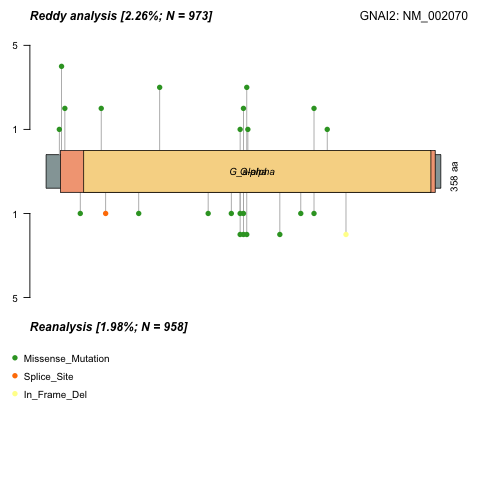

# Lymphoma/Leukemia Molecular Profiling Project

This is the landing page for the growing set of resources for lymphoma genomics that is being produced within the LLMPP. 

## Where to start

If you want, you can simply peruse the GitHub repository using the web interface. If you want all the files in the repository, you can download the repository using the button above (select "Download Zip" or clone the repository, if you are a git user). 

### Resource files

This repository contains a curated DLBCL gene list, which is maintained by the Morin lab. A few variants of this list can be found under `resources/curated` [more information can be found here](resources/curated/Readme.md).

### Images

There are several directories under `literature/mutation_patterns/lollipop/` that contain representations of the underlying data from the cohorts we have analyzed. In essence, we have generated sets of lollipop plots for each study a few ways.

For plots from individual studies, look under one of the directories with this naming pattern:
`literature/mutation_patterns/lollipop/by_study/TYPE/STUDY`
Here, the three types of plots that might be available are *compare*, *as_reported*, and *gambl_reanalysis*. The *compare* directory contains sets of images for any cohort that has lollipop plots that directly contrast the mutation pattern between the variants reported in the study and our analysis. The *as_reported* and *gambl_reanalysis* directories are probably self-explanatory. Essentially, these are individual lollipop plots from the study using either the mutations reported in that study or those identified in our re-analysis of the data from that study.   

Finally, for one of the studies (so far), there are lollipop plots that compare the mutations as they were reported by the authors to the mutations detected through re-analysis of the raw data. These can be found under:

`literature/mutation_patterns/lollipop/by_study/gambl_reanalysis/`

