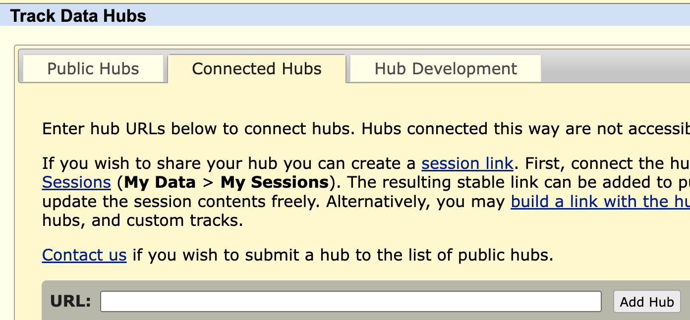
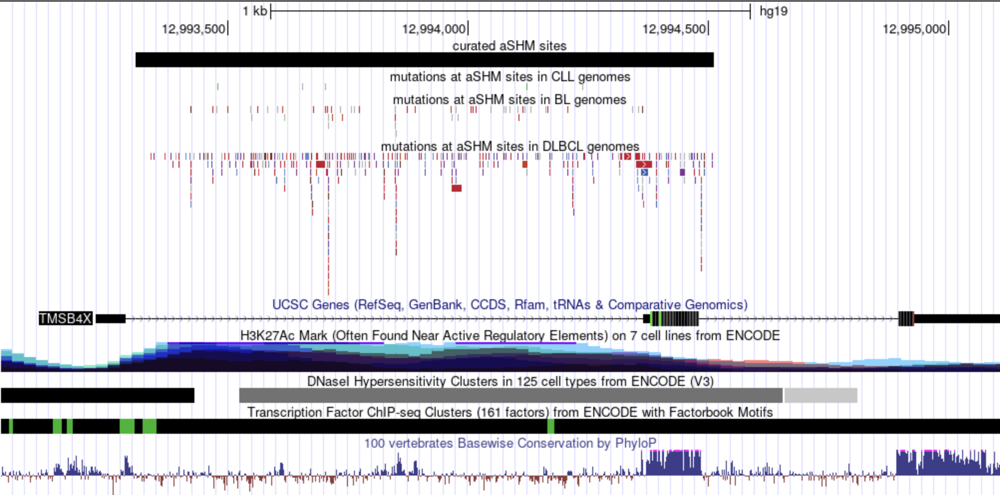

# UCSC Trackhub for GAMBL

## What data is available

## How to visualize it

Navigate to the [UCSC genome browser](http://genome.ucsc.edu/cgi-bin/hgGateway) and make sure hg19 is selected. Enter any gene of interest into the search box. If you don't have a favourite gene, you can enter *EZH2*. Once you are in the genome browser, select the _Track Hubs_ option in the _My Data_ menu at the top. This should bring you to the Track Hubs menu. Select the middle tab, as shown in the screenshot below. 

Copy [this url](https://raw.githubusercontent.com/morinlab/LLMPP/main/hubs/ashm/hub.txt) to your clipboard and paste it into the box to the right of *URL* and click _add hub_. This should bring you back to the browser with the custom tracks now shown. If you don't see anything you may need to navigate to a different region. 
Try pasting this region into the navigation box: `chr6:37,136,653-37,141,935` or, to reproduce the image below, use `chrX:12,993,029-12,995,149`

