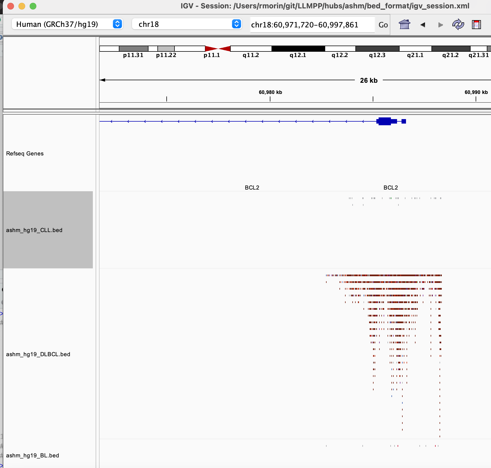

# Mutation pattern browsers for GAMBL

```
  /$$$$$$     /$$$$$$    /$$      /$$   /$$$$$$$    /$$. 
 /$$__  $$   /$$__  $$  | $$$    /$$$  | $$__  $$  | $$. 
| $$  \__/  | $$  \ $$  | $$$$  /$$$$  | $$  \ $$  | $$. 
| $$ /$$$$  | $$$$$$$$  | $$ $$/$$ $$  | $$$$$$$   | $$. 
| $$|_  $$  | $$__  $$  | $$  $$$| $$  | $$__  $$  | $$. 
| $$  \ $$  | $$  | $$  | $$\  $ | $$  | $$  \ $$  | $$. 
|  $$$$$$/  | $$  | $$  | $$ \/  | $$  | $$$$$$$/  | $$$$$$$$. 
 \______/   |__/  |__/  |__/     |__/  |_______/   |________/. 
~~GENOMIC~~~~~~~~~~~~~OF~~~~~~~~~~~~~~~~~B-CELL~~~~~~~~~~~~~~~. 
~~~~~~~~~~~~~ANALYSIS~~~~~~MATURE~~~~~~~~~~~~~~~~~~~LYMPHOMAS~. 
```

## What data are available

Currently, there is a single browser hub that provides access to the anonymized mutations from the genomes in GAMBL subset to the regions we identified as being recurrently affected by aSHM. There are separate tracks for CLL, Burkitt lymphoma (BL) and diffuse large B-cell lymphoma (DLBCL). Mutations are coloured according to the LymphGen class of that patient as determined from their genome-wide mutation profile. The colour key we use can be found [here](https://morinlab.github.io/LLMPP/colours.html). Additional hubs with more informative colour schemes for non-DLBCL entities are in the works. 

## How to visualize on UCSC

Navigate to the [UCSC genome browser](http://genome.ucsc.edu/cgi-bin/hgGateway) and make sure hg19 is selected. Enter any gene of interest into the search box. If you don't have a favourite gene, you can enter *EZH2*. For a shortcut, you can also use [this link](https://genome.ucsc.edu/cgi-bin/hgTracks?db=hg19&position=chr18%3A60977274-60991908) to jump directly to the BCL2 locus. Once you are in the genome browser, select the _Track Hubs_ option in the _My Data_ menu at the top. This should bring you to the Track Hubs menu. Select the middle tab, as shown in the screenshot below. 


Copy [this url](https://raw.githubusercontent.com/morinlab/LLMPP/main/hubs/ashm/hub.txt) to your clipboard and paste it into the box to the right of *URL* and click _add hub_. This should bring you back to the browser with the custom tracks now shown. If you don't see anything you may need to navigate to a different region. 
Try pasting this region into the navigation box: `chr6:37,136,653-37,141,935` or, to reproduce the image below, use `chrX:12,993,029-12,995,149`


## How to visualize in IGV

The repository contains bed files that can be loaded in IGV (in the `bed_format` directory). If you download or clone the repository, you can load those into IGV individually. You can also open the xml file as an IGV session. 



