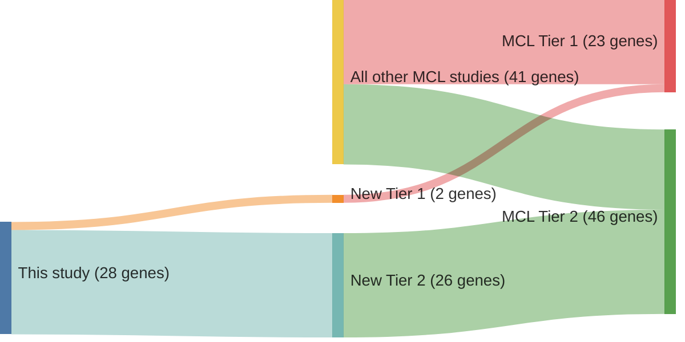

# @zhangGenomicLandscapeMantle2014
## Summary of novel genes

|Entity| Tier 1 genes| Tier 2 genes|
|:-:|:-:|:-:|
|MCL|2|26|

## Novel genes reported in this study

|New gene|MCL tier|
|:-|:-:|
|[ANK2](../ANK2)|2 |
|[ATP11C](../ATP11C)|2 |
|[CDH8](../CDH8)|2 |
|[COL11A1](../COL11A1)|2 |
|[COL16A1](../COL16A1)|2 |
|[CTNNA2](../CTNNA2)|2 |
|[DHDH](../DHDH)|2 |
|[DLC1](../DLC1)|2 |
|[EIF2AK4](../EIF2AK4)|2 |
|[ESX1](../ESX1)|2 |
|[FAT4](../FAT4)|2 |
|[GRIN2A](../GRIN2A)|2 |
|[HEPH](../HEPH)|2 |
|[KMT2C](../KMT2C)|2 |
|[MRGPRF](../MRGPRF)|2 |
|[NIN](../NIN)|2 |
|[OGDHL](../OGDHL)|2 |
|[PCDHB2](../PCDHB2)|2 |
|[PLXNB3](../PLXNB3)|2 |
|[POT1](../POT1)|1 |
|[RB1](../RB1)|1 |
|[ROBO2](../ROBO2)|2 |
|[SALL3](../SALL3)|2 |
|[SI](../SI)|2 |
|[SMC1A](../SMC1A)|2 |
|[TBC1D26](../TBC1D26)|2 |
|[ZNF117](../ZNF117)|2 |
|[ZNF296](../ZNF296)|2 |

# Details

